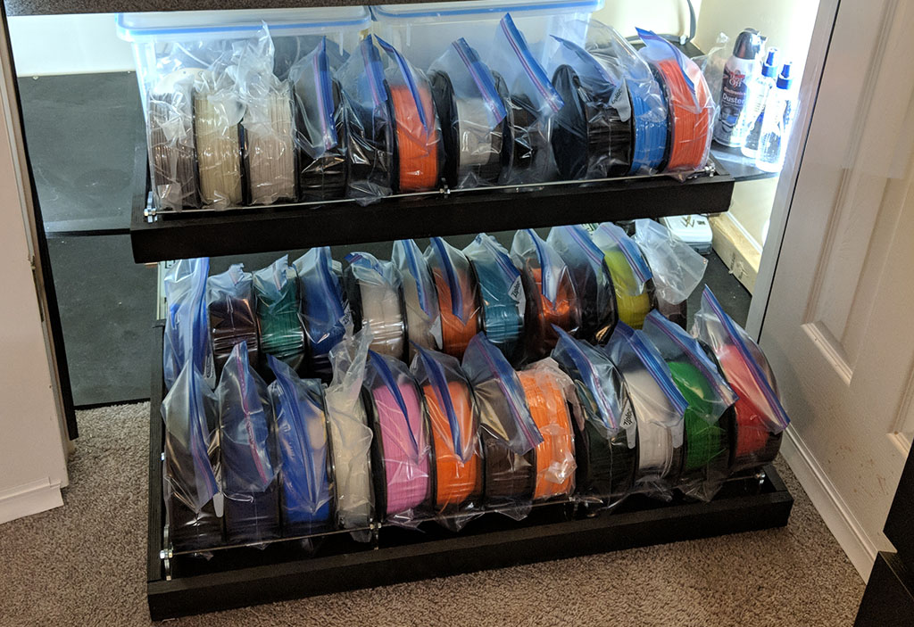
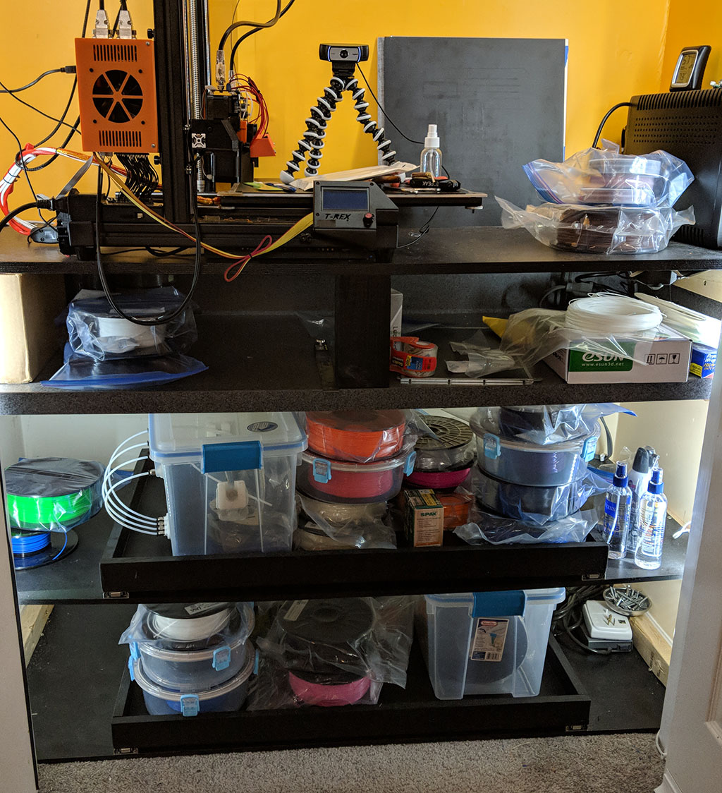
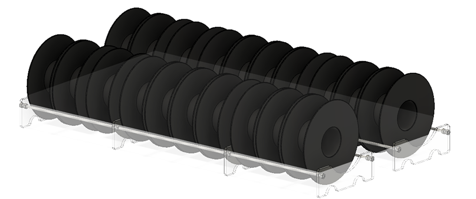

As a lover of 3D printing, I of course, have a ton of filament for use with my Formbot T-Rex 2+. For reasons unknown to me, my office at home had a closet with a desk and power built into it. So way back when we got our MakerBot in 2013 it was quickly decided that it would be a great place for the printer. I've done a number of improvements over the years like sealing up the doors to make the whole thing a heated chamber (this works especially well with the Formbot's 800W heated bed) and building some slide out shelves on the bottom.

Needless to say, these shelves quickly got to be a big mess...

I've been a long time subscriber to the [MakerGeeks Geek Box](https://www.makergeeks.com/products/3d-geek-box-monthly-filament-3d-geek-box) which is a great way to get a lot of high quality filament for super cheap, if you aren't too picky about what exactly you get every month. So far I've been pleasently surprised with the fun new types of material I've gotten every month.

While I do use a lot of this filament pretty quickly it still meant that I had a storage problem before long. To Fusion 360!

I do everything in Fusion 360... I've even modeled my entire garage with shelves, and workbenches. It's a wonderful tool. So, I quickly whipped up this:

The entire CAD model is available [here](https://a360.co/2IFcV4K) for those interested.

There really was no major reason to CAD model the entire thing, but it was only a little extra time and it lets me make sure that everything would fit as expected. In reality the only part that came out of this modeling was the laser cut, 6mm acrylic "foot":

This could be 3D printed of course and if I was going to do that it would be designed entirely differently. But I have a [LaserSaur](http://lasersaur.com) and to paraphrase Dan, "When you've got a laser cutter, everything looks like a nail".

I already had some cheap 6mm clear acrylic I picked up at the [Durham Scrap Exchange](http://scrapexchange.org/) (if you live anywhere near Raleigh/Durham you *must* check them out!) which was scuffed up and therefore no good for anything that needed pristine acrylic, but would work fine for this.

Assembly of the racks is easy and only requires the following:

- 2+ laser cut "feet", depending on length of rack you need
- 2x 1/4"-20 threaded rod, cut to length
- 4x 1/4"-20 nuts, per foot

The 1/4"-20 rods and nuts could easily be swapped out for 6mm variants if you're locale doesn't use Freedom Units&trade; (I kid... I would much rather use metric, but am stuck with imperial for building materials).

Now comes the hard part of threading the nuts down at least half the length of each rod to place the middle feet. Just be sure that everything is perfectly even between each rod so that the feet end up sitting perfectly perpendicular to the rods.

That's it. Now it's super easy to keep all your 1kg filament spools neat and organized. Doesn't it look so much better now?

