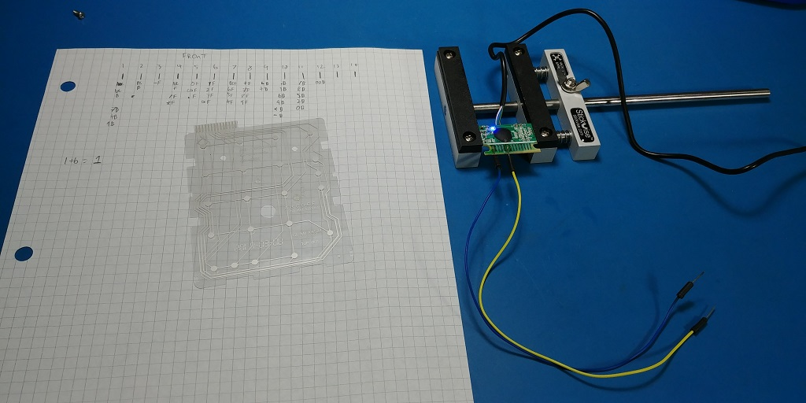
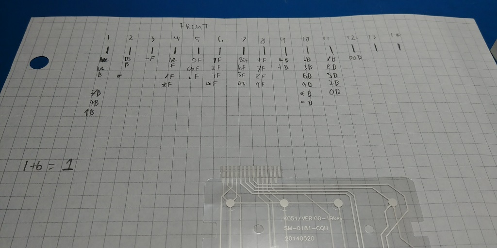

Yes, there is a virtual pinball table in existence at the Maniacal Labs Satellite Office (aka my house). More on this later, and in more detail! But for now, just a quick blurb on that project.

In short, the table consists of a TV on a 2x4 frame, raised and angled in such a way...

You know a picture would be much better...

The PC runs the software (Pinball FX 2 on Steam), and I'm pretty happy with the basic feel of it so far. Obviously there's much more work to do, and I'm still in the 'Proof of Concept' stage.

One of the key pieces is Input. No fun playing a pinball-shaped game without flipper buttons!

The software allows for key re-mapping, so pretty much any keystroke can be assigned to any function. Currently, I have an Arduino Leonardo taking input from a few arcade switches and sending keystrokes back to the PC to move the flippers and launch the ball. This setup works, but I think there's a simpler way...

I grabbed a [cheap USB number pad](https://www.amazon.com/gp/product/B01E8TTWZ2) off Amazon. The goal is to re-use the numpad controller, with custom, external buttons, to send keystrokes to the software. This is about as low-latency as I can think of, which is great for this kind of quick-reflexes application. Also, a USB numpad is cheaper than an Arduino Leonardo ;). The trick here is reverse-engineering the numpad controller...

Basically, if the right two pins on the controller PCB are shorted, a certain key is sent. So its just a matter of identifying what pin combinations produce what keystrokes. In the setup I have pictured in this post, if I touch the blue and yellow wires, a number one is sent.

Now that I know the basic idea works, the next step is to build a little breakout board to allow for easy button hook-up to the various pins on that controller. From there, it's just a matter of mapping the keys in the software, and Hey Presto, Pinball! :D

More on this as it develops ;)